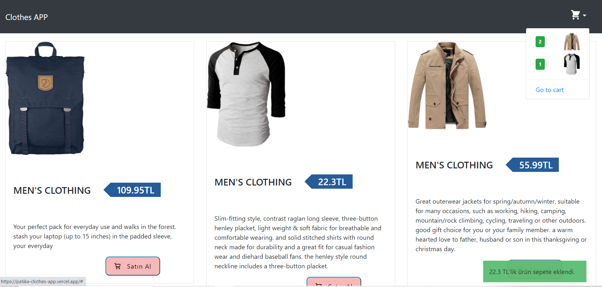

# Clothes Uygulaması
<hr/>

Patika Frontend Web Development Projeleri için geliştirilmiş web uygulaması.

## Demo

Uygulama Demosunu görmek için: [https://patika-clothes-app.vercel.app/](https://patika-clothes-app.vercel.app/)


### `Uygulama Anasayfası`


## Klonlama
##### Depoyu klonlama
```
git clone https://github.com/faruk-gkc/Patika-ClothesApp.git

```


##### Kopyamız hazır, biz hazırız :)
### Kurulum

##### Gereksinimleri kuruyoruz
```
npm install
```
##### Uygulamayı çalıştırıyoruz, adresimiz: localhost:3000
```
npm run dev
```
##### ya da bu komut ile de aynı işlemi yapabiliriz
```
npm start
```

##### Uygulamamızı kuruluma hazır hale getirmek için kullanırız.
```
npm run build
```
##### daha fazla komut için package.json dosyasını kontrol edebilir kendi komutlarınızı yazabilirsiniz.


